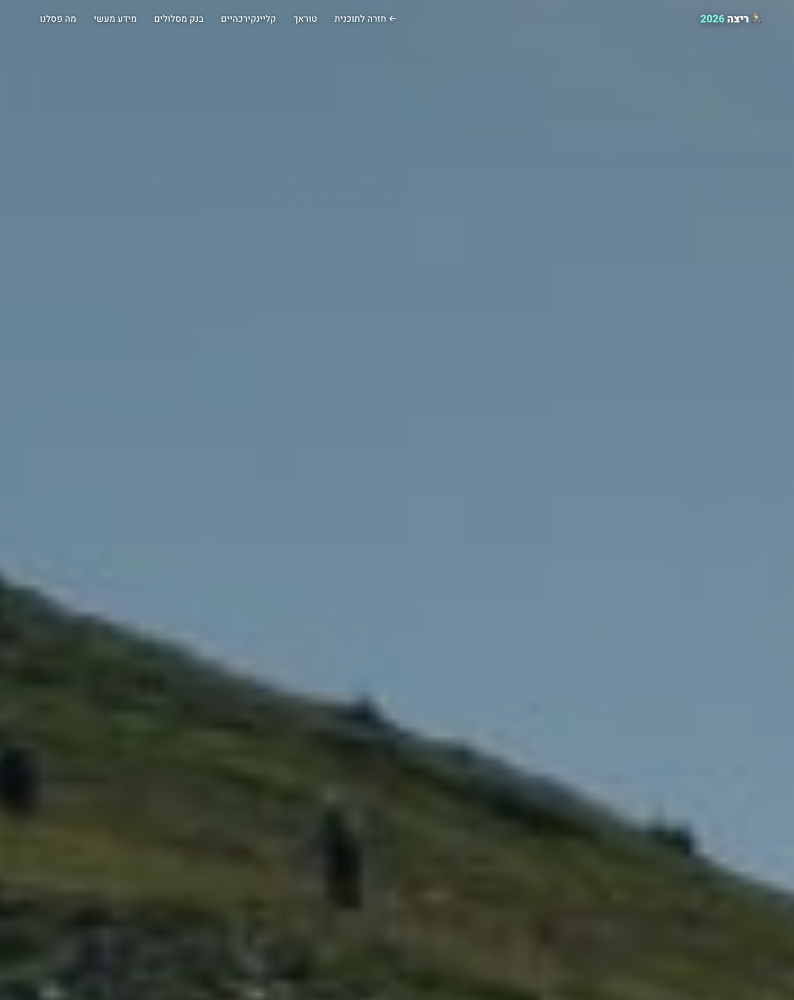
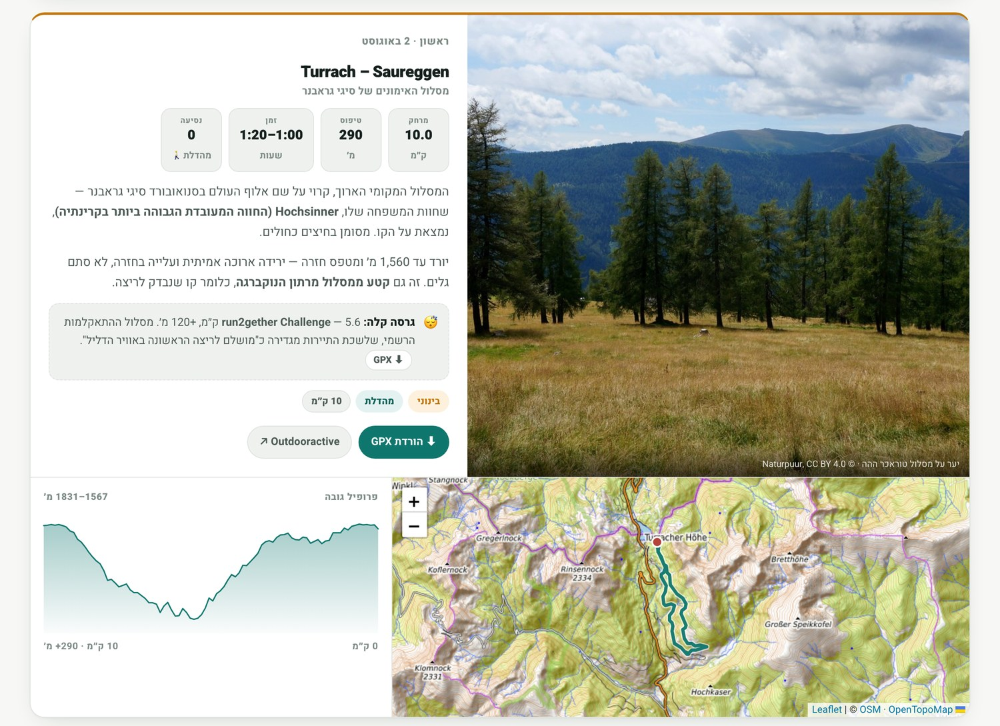
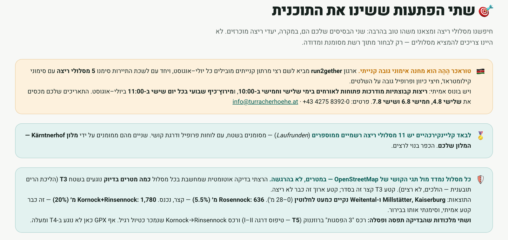

# Trail Route Planner — a Claude Code skill

Turn *"find me some runs near the hotel"* into a verified, navigable, day-by-day
plan — with GPX files a watch can actually follow, difficulty checked in **metres**
of hard terrain, and a published page of maps, elevation profiles, and photos.

This is a [Claude Code](https://claude.com/claude-code) **skill**: a folder of
instructions and scripts that Claude loads on demand when a task matches. It was
built while planning two weeks of morning runs for a family trip to Carinthia,
Austria, and then generalised so it works for any place.



> The example output is in Hebrew because the trip was for an Israeli family — the
> skill produces the page in whatever language fits the user. Everything else on
> the page (maps, GPX, elevation profiles) is language-neutral.

---

## Why this exists

Ask any assistant for "good trail runs near X" and you'll get a plausible list.
The problem is that a plausible list is **wrong often enough to hurt you**:

- The "route" is a name, not a track. You still can't put it on your watch.
- The distance and climb are guesses, sometimes off by a lot.
- "Runnable / easy / T2" is repeated from a tour site that never checked — and the
  actual trail turns into hands-on scrambling halfway up.

This skill treats those three failures as the whole job. It doesn't *describe*
routes; it **builds and verifies** them.

---

## What it produces

**1. Real GPX, from real trail geometry.** Waypoints are routed through
[BRouter](https://brouter.de), which snaps to actual OpenStreetMap paths and
returns elevation. No hand-drawn straight lines. Every measured distance is
cross-checked against the published figure — they agree within ~10%, or something
is wrong and gets investigated before shipping.

**2. A difficulty audit measured in metres.** Every track is checked against
OpenStreetMap's [`sac_scale`](https://wiki.openstreetmap.org/wiki/Key:sac_scale)
hiking grades. Instead of a useless yes/no, it reports *how many metres* of each
route sit on terrain too hard to run — so a human can make the call.

**3. A day-by-day page** with an interactive map and elevation profile per route,
a GPX download, a photo, and — for every day — a **shorter "if the legs said no"
fallback**. Plus a route bank and an honest *"what we rejected and why"* table.



---

## The part that matters: verification catches what research gets wrong

Here's the intro of a real generated plan. The teal box is the automated audit
talking:



On this one trip, measuring terrain in metres instead of trusting the sources
changed the plan repeatedly:

| Route | The sources said | The audit measured | Call |
|---|---|---|---|
| Millstätter Alpe ridge | "T2, runnable" | **0 m** of T3 | ✅ marquee day |
| A tempting summit ridge | "normal tour" | **1,780 m of T3 (20%)** | ⚠️ flagged: walk the ridge |
| A "classic, fully runnable" loop | "T2" | **636 m of T3 (5.5%)** | ✅ short section, kept |
| A variant with *perfect* stats | "great tour" | **T5 — grade I–II climbing** | ❌ rejected outright |

The trap routes had the most attractive numbers. That's exactly why they need
measuring rather than trusting.

---

## Install

Drop the folder into your Claude Code skills directory:

```bash
git clone https://github.com/sdanpo/trail-route-planner.git
cp -r trail-route-planner ~/.claude/skills/trail-route-planner
```

Then just ask Claude Code something like *"plan morning runs near my hotel in
Chamonix for a week — I run 10–15 km"* and the skill loads automatically. It will
ask a few scoping questions (level, timing, how far you'll drive, terrain
tolerance) before it starts.

You can also run the two scripts by hand — they have no dependencies beyond Python
3 and (for the images) Pillow.

### Build GPX from waypoints

`examples/routes.json`:

```json
[
  { "id": "kornock", "name": "Kornock Runde (2,193 m)", "profile": "hiking-beta",
    "waypoints": [[46.91458,13.87362],[46.91547,13.85571],[46.92290,13.87060],[46.91458,13.87362]] }
]
```

```bash
python3 scripts/build_gpx.py examples/routes.json out/
# kornock   7.3 km  +516 m  (1778-2192 m)   <- compare against the published 7.5 km / 520 m
```

`waypoints` are `[lat, lon]`, **ordered**, tracing the route. BRouter fills in the
real path between them. (`examples/kornock.gpx` is the output.)

### Audit a track for un-runnable terrain

```bash
python3 scripts/audit_sac.py out/kornock.gpx
# kornock    48 m hard of 7349 m (0.7%)  T3:48m  -> walk it
```

---

## What's in the box

```
SKILL.md              the workflow Claude follows (+ the traps, below)
scripts/build_gpx.py  waypoints -> navigable GPX via BRouter (OSM geometry)
scripts/audit_sac.py  GPX -> metres of T3+ terrain via OSM sac_scale
examples/             a runnable routes.json and its generated GPX
images/               screenshots of a generated plan
```

`SKILL.md` also records the **traps that bit me** so the next run doesn't repeat
them, including:

- **lat/lon order.** BRouter writes `lon` before `lat`; most other GPX writes
  `lat` first. Swap them and east–west distance inflates by ~1/cos(latitude) —
  about **+25%** in the Alps — while producing numbers that look completely
  plausible. I shipped this bug and briefly "found" a 25% error in data that was
  correct all along.
- **Overpass** (the OSM query API) returns HTTP 406 with no `User-Agent` and
  rate-limits hard — sleep between calls, never parallelise.
- **Leaflet `bringToBack()`** on a fresh polyline throws and silently aborts your
  map init. Draw the casing line first instead.
- **Cable cars and toll roads have opening hours** (often 08:00–09:00). A stunning
  route you can't start at 06:00 is useless to an early-morning runner — so a
  door-start route is worth calling out.

---

## Non-negotiables

The skill is built around a few rules, because the deliverable is trust:

- Never invent a coordinate or a trail. If it's unverified, the page says so.
- Never present a hand-drawn line as a GPS track.
- Say where the plan is uncertain — an unconfirmed toll time, a photo that's a
  regional stand-in, a hotel whose exact location isn't in OSM. A confidently
  wrong route sends a real person onto a mountain.

---

## Credits & licence

Built with [Claude Code](https://claude.com/claude-code). Routing by
[BRouter](https://brouter.de); trail data and difficulty grades from
[OpenStreetMap](https://www.openstreetmap.org/copyright) contributors; map tiles
from [OpenTopoMap](https://opentopomap.org/) (CC-BY-SA); route photos from
Wikimedia Commons under their respective licences.

MIT — see [LICENSE](LICENSE).
